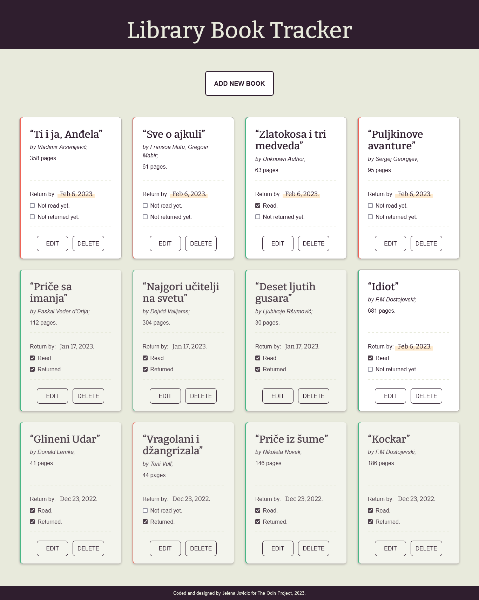

WIP

# The Odin Project - Library

A Library app to keep track of borrowed books. Built using JavaScript, HTML, and Sass for [The Odin Project](https://www.theodinproject.com).

## Table of contents

- [Overview](#overview)
  - [Description](#description)
  - [Screenshot](#screenshot)
  - [Links](#links)
- [My process](#my-process)
  - [Built with](#built-with)
  - [The process](#the-process)
  - [Useful resources](#useful-resources)
- [Author](#author)

## Overview

### Description

A small borrowed books tracking app made as a part of [The Odin Project](https://www.theodinproject.com) curriculum, with added functionality to keep track of dates when books are due to be returned.

### Screenshot

### Links

- [Solution](https://github.com/je-jo/library)
- [Live Site](https://je-jo.github.io/library/)

## My process

### Built with

- Semantic HTML5 markup
- Sass
- CSS Grid
- Mobile-first workflow
- JavaScript

### The process

This project uses templating technique to clone a "card" element instead of creating a new one each time a new book is created. 

Dialog element is used instead of confirm prompt for deletion.

### Useful resources

- [How To Lint and Format Code with ESLint in Visual Studio Code](https://www.digitalocean.com/community/tutorials/linting-and-formatting-with-eslint-in-vs-code) - A tutorial for setting up ESLint for a project.
- [Templating in HTML](https://kittygiraudel.com/2022/09/30/templating-in-html/) - "Long story short, templates are good to avoid creating complex DOM structures by hand."
- [7-1 pattern boilerplate](https://github.com/KittyGiraudel/sass-boilerplate/tree/master/stylesheets) - A boilerplate for 7-1 Sass Architecture.
- [HTML / Sass Jumpstart]() - Mostly plucked some sensible values (font sizes, spacings, etc) from here.
- [Introducing the Dialog Element](https://webkit.org/blog/12209/introducing-the-dialog-element/).

## Author

- [Github](https://github.com/je-jo)
- [Frontend Mentor](https://www.frontendmentor.io/profile/je-jo)
- [Codepen](https://codepen.io/je-jo)
- [Twitter](https://twitter.com/jelena_jo_)
